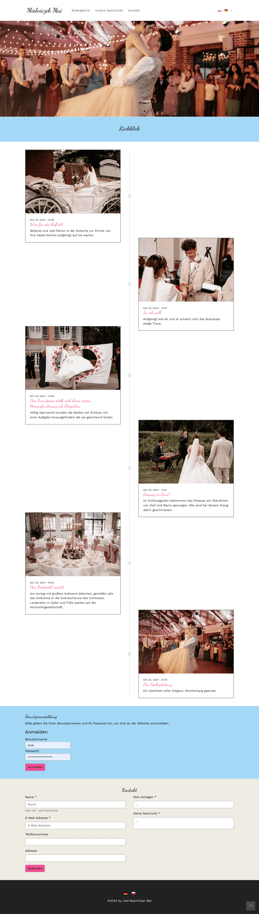
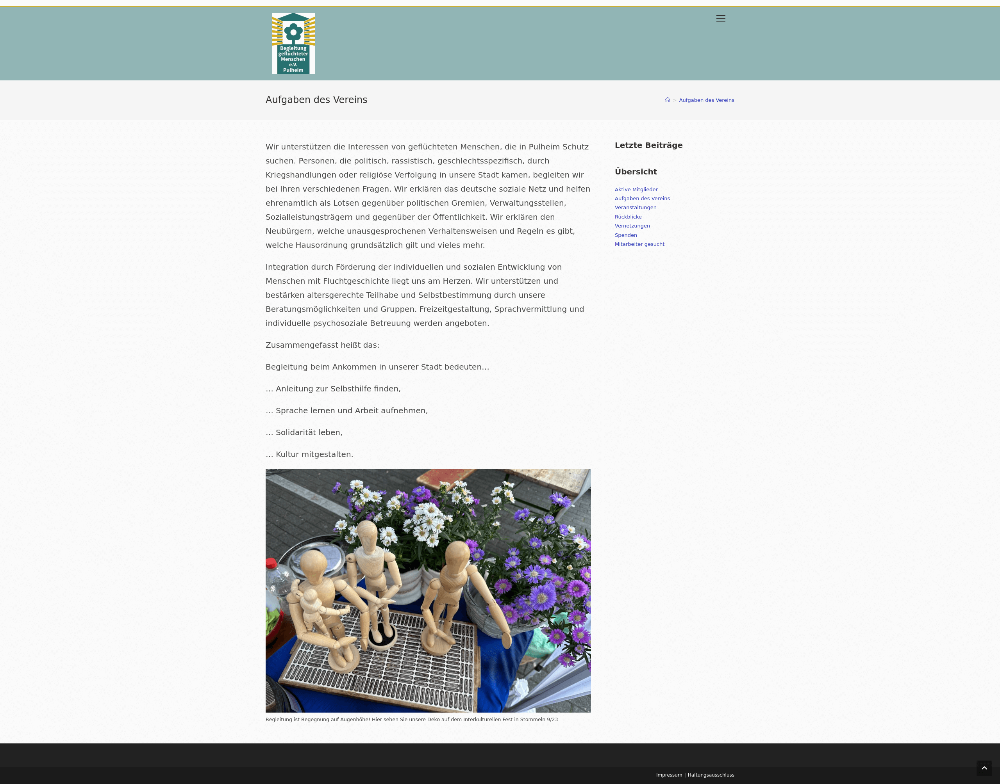

# Maispace

### About Us
We are a team of experienced developers specializing in:

| [TYPO3](https://github.com/orgs/mai-space-de/teams/typo3-devs)                      | [Wordpress](https://github.com/orgs/mai-space-de/teams/wordpress-devs)                            | [Software (Symfony, Python, Kotlin)](https://github.com/orgs/mai-space-de/teams/software-devs) |
|------------------------------|---------------------------------------------------|-----------------------|
|  |  |  |

With years of expertise in the industry, we provide high-quality solutions tailored to the needs of our clients.

### References

| [Mielniczek-Mai.com](https://mielniczek-mai.com)    | [BGM-Pulheim.org](https://bgm-pulheim.org)      |
|-----------------------------------------------------|-------------------------------------------------|
| Wedding Websites using Bootstrap and TYPO3          | Website for refugees in Pulheim using Wordpress |  
|  |        |

### Our Team

|[Joel Mai (maispace)](https://github.com/mai-space) | [Jörg Beck (JoergBeck)](https://github.com/JoergBeck) | [Philipp Grigoleit (Grigo91)](https://github.com/Grigo91) | [Timo Lauschner (tilaus)](https://github.com/tilaus) |
|----------------------------------------------------|-------------------------------------------------------|-----------------------------------------------------------|------------------------------------------------------|
| TYPO3, Symfony, Python                             | Python                                                | TYPO3, Symfony                                            | Wordpress, TYPO3, Symfony                            |
|        |          |      |    |
